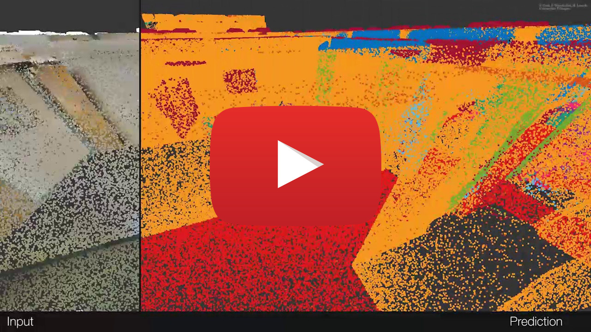
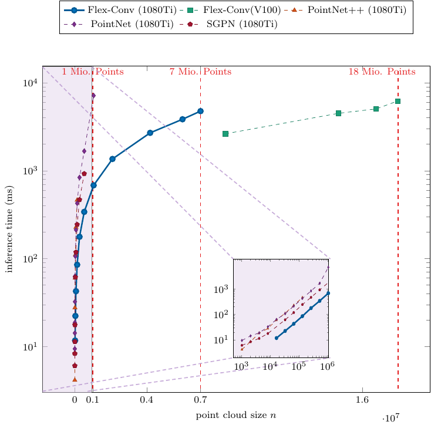
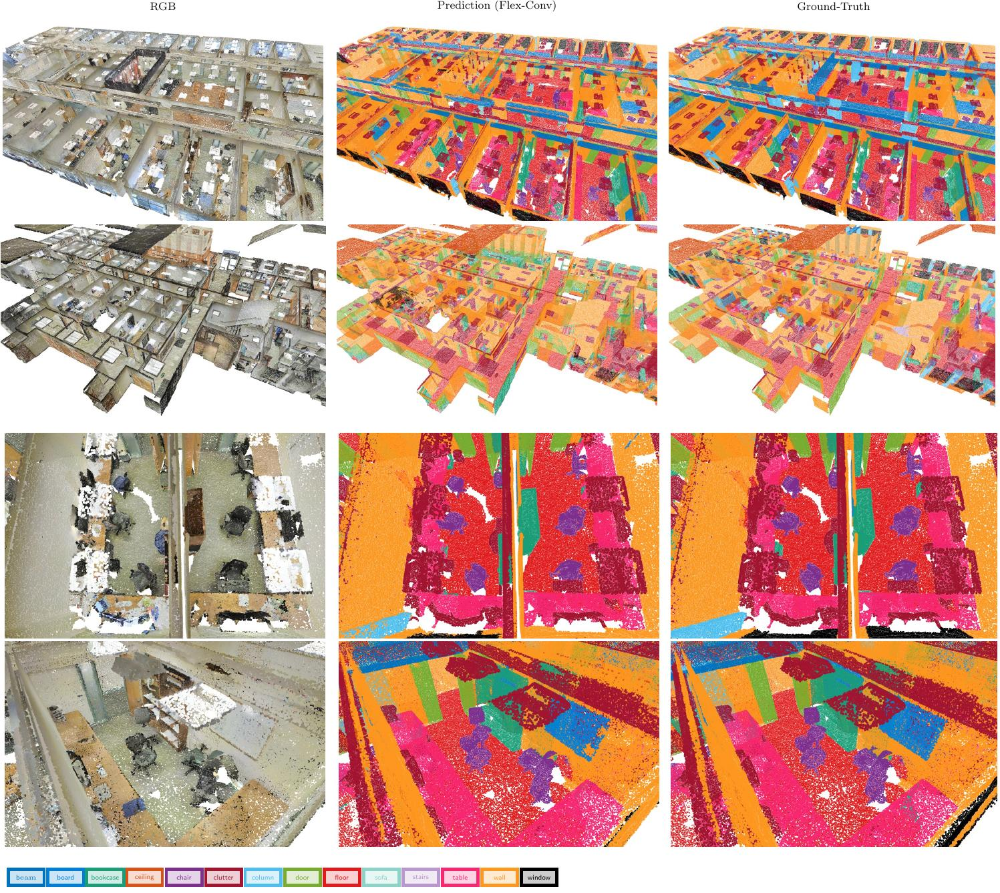

# Flex-Convolution (Million-Scale Point-Cloud Learning Beyond Grid-Worlds)
Fabian Groh, Patrick Wieschollek, Hendrik P.A. Lensch


Abstract
-------------------

Traditional convolution layers are specifically designed to exploit the natural data representation of images -- a fixed and regular grid. However, unstructured data like 3D point clouds containing irregular neighborhoods constantly breaks the grid-based data assumption. Therefore applying best-practices and design choices from 2D-image learning methods towards processing point clouds are not readily possible. In this work, we introduce a natural generalization flex-convolution of the conventional convolution layer along with an efficient GPU implementation. We demonstrate competitive performance on rather small benchmark sets using fewer parameters and lower memory consumption and obtain significant improvements on a million-scale real-world dataset. Ours is the first which allows to efficiently process 7 million points concurrently.


The following figure shows the *raw* network semantic segmentation prediction on a real-world example:

<p align="center">  </p>


This repository contains the source code of our FlexConv Layer from our 2018 ACCV paper "Flex-Convolution (Million-Scale Point-Cloud Learning Beyond Grid-Worlds)".

<p align="center"> <a href="https://www.youtube.com/watch?v=5ftWmuQXU_s"></a> </p>


Example - Usage
-------------------

We provide GPU-tailored CUDA implementations of our novel FlexConv, FlexPool, FlexDeconv operations in TensorFlow.

```console
user@host $ cd user_ops
user@host $ cmake . -DPYTHON_EXECUTABLE=python2 && make -j
user@host $ cd ..
user@host $ python example.py
```


Experiments
-------------------

Deep learning on point-clouds is a complex matter and our codebase reflects that complexity.
We are currently working on refactoring our research implementation to ease the usage. Therefore,
`layers.py` contains a Keras/tf.layers compatible implementation. We will add the models later.

### Benchmark

We benchmarked the inference time of *entire* network on the 2D-3D-S dataset and with a recent test on a NVIDIA V100 GPU, we were able to process ~18 Million Points.

<p align="center">  </p>


### ShapeNet Segmentation

ShapeNet part segmentation results per category and mIoU (%) for different methods and inference speed (on a NVIDIA GeForce GTX 1080 Ti).

|                 | mIoU     | shapes/sec | Airplane | Bag      | Cap      | Car      | Chair    | Earphones | Guitar   | Knife    | Lamp     | Laptop   | Motorbike | Mug      | Pistol   | Rocket   | Skateboard | Table    |
| ----            | ----     | ---        | ----     | ----     | ----     | ----     | ----     | ----      | ----     | ----     | ----     | ----     | ----      | ----     | ----     | ----     | ---        | ----     |
| Kd-Network  [4] | 77.4     | n.a.       | 80.1     | 74.6     | 74.3     | 70.3     | 88.6     | 73.5      | 90.2     | **87.2** | 81.0     | 94.9     | 57.4      | 86.7     | 78.1     | 51.8     | 69.9       | 80.3     |
| PointNet  [1]   | 80.4     | n.a.       | 83.4     | 78.7     | 82.5     | 74.9     | 89.6     | 73.0      | 91.5     | 85.9     | 80.8     | 95.3     | 65.2      | 93.0     | 81.2     | 57.9     | 72.8       | 80.6     |
| PointNet++ [2]  | 81.9     | 2.7        | 82.4     | 79.0     | 87.7     | 77.3     | **90.8** | 71.8      | 91.0     | 85.9     | 83.7     | 95.3     | 71.6      | 94.1     | 81.3     | 58.7     | 76.4       | 82.6     |
| SPLATNet3D [3]  | 82.0     | 9.4        | 81.9     | 83.9     | 88.6     | **79.5** | 90.1     | 73.5      | 91.3     | 84.7     | **84.5** | 96.3     | 69.7      | 95.0     | 81.7     | 59.2     | 70.4       | 81.3     |
| SGPN  [5]       | 82.8     | n.a.       | 80.4     | 78.6     | 78.8     | 71.5     | 88.6     | **78.0**  | 90.9     | 83.0     | 78.8     | 95.8     | **77.8**  | 93.8     | **87.4** | 60.1     | **92.3**   | **89.4** |
| Ours            | **85.0** | **489.3**  | **83.6** | **91.2** | **96.7** | **79.5** | 84.7     | 71.7      | **92.0** | 86.5     | 83.2     | **96.6** | 71.7      | **95.7** | 86.1     | **74.8** | 81.4       | 84.5     |


### 2D-3D-S dataset

Class specific average precision (AP) on the 2D-3D-S dataset.

|              | mAP       | Table     | Chair     | Sofa      | Bookcase  | Board     | Ceiling   | Floor     | Wall      | Beam      | Col.      | Wind.     | Door      |
| ---          | ---       | ---       | ---       | ---       | ---       | ---       | ---       | ---       | ---       | ---       | ---       | ---       | ---       |
| Armeni [6]   | 49.93     | 46.02     | 16.15     | 6.78      | 54.71     | 3.91      | 71.61     | 88.70     | 72.86     | 66.67     | **91.77** | 25.92     | 54.11     |
| Armeni [6]   | 44.19     | 39.87     | 11.43     | 4.91      | **57.76** | 3.73      | 50.74     | 80.48     | 65.59     | 68.53     | 85.08     | 21.17     | 45.39     |
| PointNet [1] | n.a.      | 46.67     | 33.80     | 4.76      | n.a.      | 11.72     | n.a.      | n.a.      | n.a.      | n.a.      | n.a.      | n.a.      | n.a.      |
| SGPN     [5] | 54.35     | 46.90     | 40.77     | 6.38      | 47.61     | 11.05     | 79.44     | 66.29     | **88.77** | **77.98** | 60.71     | **66.62** | **56.75** |
| Ours         | 55.27     | 66.03     | 51.75     | 15.59     | 39.03     | 43.50     | 87.20     | 96.00     | 65.53     | 54.76     | 52.74     | 55.34     | 35.81     |
| Ours**       | **56.55** | **67.02** | **52.75** | **16.61** | 39.26     | **47.68** | **87.33** | **96.10** | 65.52     | 56.83     | 55.10     | 57.66     | 36.76     |




More Resources
-------------------

- [Arxiv Pre-Print](https://arxiv.org/abs/1803.07289)
- [Video](https://www.youtube.com/watch?v=5ftWmuQXU_s)
- [Project-Page](https://uni-tuebingen.de/fakultaeten/mathematisch-naturwissenschaftliche-fakultaet/fachbereiche/informatik/lehrstuehle/computergrafik/lehrstuhl/publications/publications-since-2012/flex-convolution-million-scale-point-cloud-learning-beyond-grid-worlds/)


Citation
-------------------
If you use the code in this repository, please cite our paper:
```
@inproceedings{accv2018/Groh,
  author    = {Fabian Groh and
               Patrick Wieschollek and
               Hendrik P. A. Lensch
               },
  title     = {Flex-Convolution (Million-Scale Point-Cloud Learning Beyond Grid-Worlds)},
  booktitle = {Asian Conference on Computer Vision (ACCV)},
  month     = {Dezember},
  year      = {2018}
}
```

References
-------------------

[1] C. Qi, H. Su, K. Mo, L. Guibas, "PointNet: Deep Learning on Point Sets for 3D Classification and Segmentation", Proceedings of the IEEE Conference on Computer Vision and Pattern Recognition (CVPR) 2017.<br/>
[2]  C. Qi and L. Yi, H. Su, L. Guibas, "PointNet++: Deep Hierarchical Feature Learning on Point Sets in a Metric Space", Advances in Neural Information Processing Systems (NIPS) 2017.<br>
[3] H. Su, V. Jampani, D.Sun, S. Maji, E. Kalogerakis, M.-H. Yang, J. Kautz, "SPLATNet: Sparse Lattice Networks for Point Cloud Processing", Proceedings of the IEEE Conference on Computer Vision and Pattern Recognition (CVPR) 2018.<br>
[4] R. Klokov, V. Lempitsky, "Escape from Cells: Deep Kd-Networks for the Recognition of 3D Point Cloud Models", Proceedings of the IEEE International Conference on Computer Vision (ICCV) 2017. <br>
[5] W. Wang, R. Yu, Q. Huang, U. Neumann, "Sgpn: Similarity group proposal network for 3d point cloud instance segmentation", Proceedings of the IEEE Conference on Computer Vision and Pattern Recognition (CVPR) 2018.<br>
[6] I. Armeni, A. Sax, A.-R. Zamir, S. Savarese, "Joint 2D-3D-Semantic Data for Indoor Scene Understanding", ArXiv e-prints 2017.
