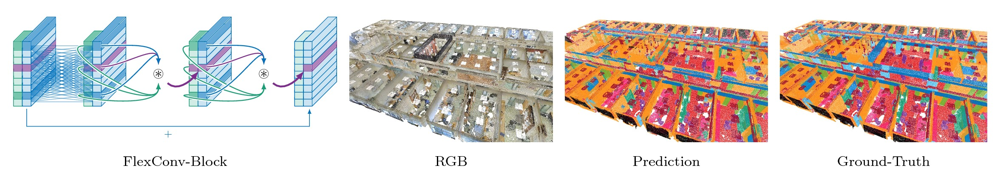

# Flex-Convolution (Million-Scale Pointcloud Learning Beyond Grid-Worlds)
Fabian Groh, Patrick Wieschollek, Hendrik P.A. Lensch


Abstract
-------------------

Traditional convolution layers are specifically designed to exploit the natural data representation of images -- a fixed and regular grid. However, unstructured data like 3D point clouds containing irregular neighborhoods constantly breaks the grid-based data assumption. Therefore applying best-practices and design choices from 2D-image learning methods towards processing point clouds are not readily possible. In this work, we introduce a natural generalization flex-convolution of the conventional convolution layer along with an efficient GPU implementation. We demonstrate competitive performance on rather small benchmark sets using fewer parameters and lower memory consumption and obtain significant improvements on a million-scale real-world dataset. Ours is the first which allows to efficiently process 7 million points concurrently.


The following figure shows the *raw* network semantic segmentation prediction on a real-world example:

<p align="center">  </p>


This repository contains contains the source code of our FlexConv Layer from our 2018 ACCV paper "Flex-Convolution (Million-Scale Pointcloud Learning Beyond Grid-Worlds)".

Example - Usage
-------------------

We provide GPU-tailored cuda implementation of our novel FlexConv in TensorFlow.

```console
user@host $ cd user_ops
user@host $ cmake . -DPYTHON_EXECUTABLE=python2 && make -j
user@host $ cd ..
user@host $ python example
```


Experiments
-------------------

Deep learning on point-clouds is a complex matter and our codebase reflect that complexity.
We are currently working on refactoring our research implementation to ease the usage. Therefore,
`layers.py` contains a Keras/tf.layers compatible implementation.

More Resources
-------------------

- [Arxiv Pre-Print](https://arxiv.org/abs/1803.07289)
- [Video](https://www.youtube.com/watch?v=5ftWmuQXU_s)


Citation
-------------------
If you use the code in this repository, please cite our paper:
```
@inproceedings{accv2018/Groh,
  author    = {Fabian Groh and
               Patrick Wieschollek and
               Hendrik P. A. Lensch
               },
  title     = {Flex-Convolution (Million-Scale Pointcloud Learning Beyond Grid-Worlds)},
  booktitle = {Asian Conference on Computer Vision (ACCV)},
  month     = {Dezember},
  year      = {2018}
}
```
